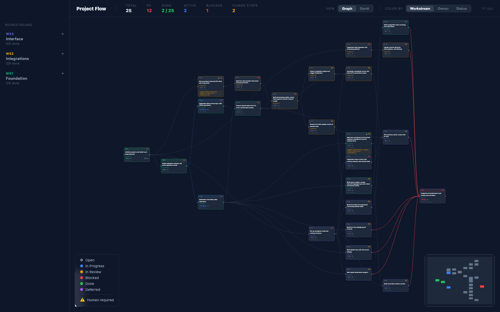
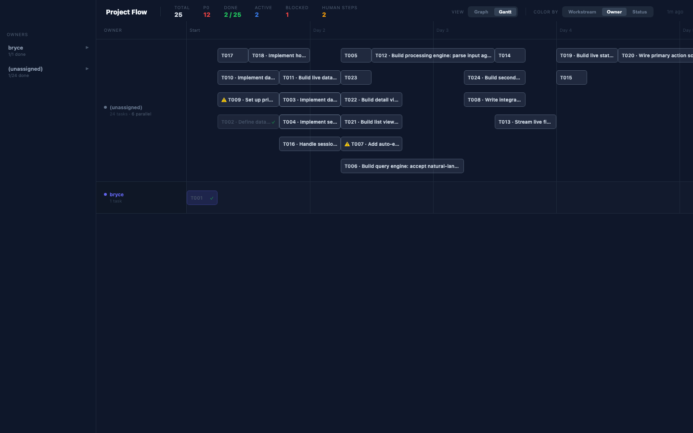
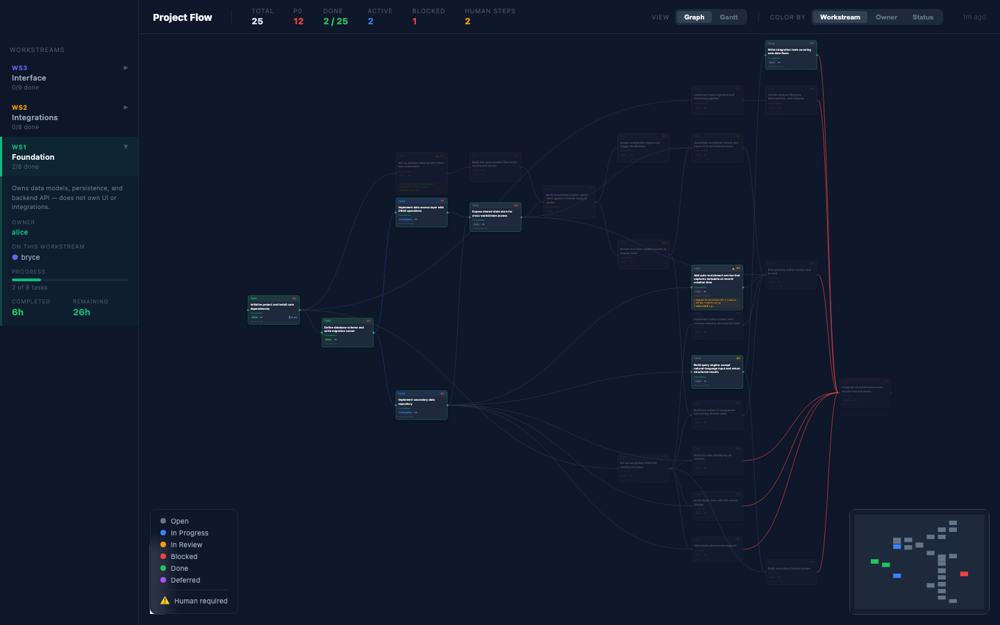
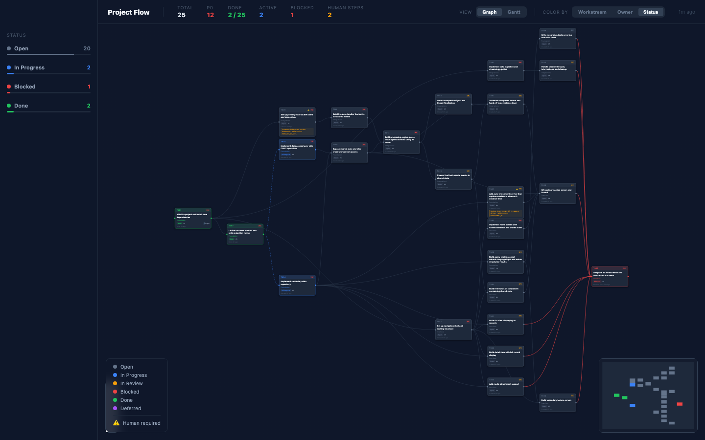

# Claude Project Planner

A toolkit for structured project setup, AI-assisted planning, and parallel agent execution.
The goal: eliminate ambiguity so human and AI agents can work faster, in parallel, with less
coordination overhead and more verifiable output.

---

## Philosophy

Most AI agent failures come from missing context, not missing capability. This toolkit solves
that by front-loading definition: every task has an owner, explicit dependencies, acceptance
criteria, and a verification guide before anyone starts working. The render view makes
execution state visible to the whole team in real time.

---

## Components

| Component | Directory | Status |
|-----------|-----------|--------|
| **boilerplate** | `boilerplate/` | Markdown templates copied into every new project |
| **planning** | `planning/` | Interactive CLI: project → plan → tasks |
| **render** | `render/` | Live browser flowchart of task execution (copied into each project by setup) |

---

## Quickstart

```sh
PLANNER=~/code/claude-project-planner   # path to this repo
pip install -r $PLANNER/planning/requirements.txt

python $PLANNER/planning/run.py ~/code/my-project
```

`run.py` is the single entry point. It walks through every phase in order, marks each one complete with a checkmark, and picks up where you left off if interrupted. To force a phase to re-run:

```sh
python $PLANNER/planning/run.py ~/code/my-project -f plan
```

Available stages: `setup`, `start`, `plan`

---

## Full Workflow

### Phase 1 — Setup

`run.py` calls `setup.py` automatically. It copies boilerplate into your project root:

- `PROJECT.md` — high-level project definition
- `PLAN.md` — workstream map and task summary
- `TASKS.md` — full task manifest with dependency graph
- `ARCHITECTURE.md` — component map and tech stack
- `STYLE.md` — linting and code style rules
- `CLAUDE.md` — Claude's reading list (loaded before every action)
- `WORKSTREAM.md` — active role and responsibilities (updated per session)
- `.claude/commands/` — slash commands: `/create-pr`, `/next`

---

### Phase 2 — Session start (`start.py`)

`run.py` calls `start.py` after setup. Run it again at the start of every new session — for humans and AI agents alike.

```sh
python $PLANNER/planning/start.py
```

- Enter your name and type (human or AI agent)
- Pick a workstream from `PLAN.md`
- Claude drafts your specific responsibilities based on workstream scope
- Writes `WORKSTREAM.md` — the first thing `CLAUDE.md` tells Claude to read

**Re-run whenever ownership changes or a new session begins.**
`WORKSTREAM.md` includes a "Current Task" field — update it as you work.

---

### Phase 3 — Planning (`plan.py`)

`run.py` calls `plan.py` once setup and start are done. Re-run with `-f plan` to update any section.

```sh
python $PLANNER/planning/plan.py
```

The script walks through **8 steps**:

| Step | What happens |
|------|-------------|
| **0. Existing repo context** | Detects git history. If building on existing code, Claude reads the repo structure, recent commits, and key config files — then surfaces questions to answer before planning |
| **1. Project definition** | Walks through `PROJECT.md`: motivation, goals, success criteria, priorities, resources, final result. Saves after each answer — crash-safe |
| **2. Tech stack** | Claude identifies components (frontend, API, DB, auth, deployment, etc.) and recommends a specific technology for each with rationale. Flags opinionated choices with alternatives |
| **3. Confirm tech stack** | Review each recommendation — accept or override per component |
| **4. Generate `ARCHITECTURE.md`** | Claude writes component boundaries, directory layout, and interfaces from the agreed stack |
| **5. Re-iterate** | Claude reviews the full plan and surfaces: gaps (things not considered), alternatives (trade-offs worth weighing), and clarifications (questions about your reasoning). Each can be skipped or answered — responses are saved to `PROJECT.md` |
| **6. Workstreams** | Specify a count (e.g. 3 for a 3-person team) or let Claude recommend. Claude names each workstream with a memorable codename (`Keymaster` for auth, `Dazzler` for frontend, `Bedrock` for DB). Each workstream gets a scope and an **owner** (name or email). Tasks default to that owner as assignee — individuals can pick up tasks across streams. Written to `PLAN.md` |
| **7. Task manifest → `TASKS.md`** | Claude generates the full task graph across all workstreams, with cross-workstream dependencies. Every task has all 14 fields filled (see schema below). Required fields are validated — blank ones are flagged for your input |
| **8. Push to BEADS** | (Optional) Pushes all tasks to [BEADS](https://github.com/gastownhall/beads) via `bd create` and links dependencies with `bd dep add`. Sets all metadata (workstream, owner, scope, estimate, depends) on each BEADS issue. Writes `.beads_map.json`. Run `migrate_to_beads_metadata.py` to backfill an existing BEADS project |

---

### Phase 4 — Execution

Once planning is done, use the slash commands inside your project's Claude Code session:

| Command | What it does |
|---------|-------------|
| `/next` | Finds the next open task for your workstream, claims it, does the work, verifies completion, then loops to the next. Stops only when done or blocked — and names the blocker explicitly |
| `/create-pr` | Pushes your branch, captures Playwright before/after screenshots if UI files changed, and opens a `gh` PR with a structured summary |

Pick tasks manually from `TASKS.md` if you prefer. Every task has:

| Field | Purpose |
|-------|---------|
| **Workstream** | Who owns it |
| **Criticality** | P0 / P1 / P2 — what's blocking vs nice-to-have |
| **Depends on / Unlocks** | DAG of task dependencies |
| **Human required** | Explicit callout for anything needing a human (API keys, billing, OAuth consent) |
| **Acceptance criteria** | Observable, specific definition of done |
| **Verification steps** | Concrete commands/flows to confirm it works — written so a bot can follow them |
| **Tricky spots** | What's subtle or commonly missed when verifying — guards against false positives |
| **Estimate** | Rough time budget |
| **Notes** | Sequencing gotchas, key decisions |
| **Assignee / Status** | Tracked per task |

Start with all P0 tasks. Update status in BEADS as you go (`bd update <id> --claim`, `bd close <id>`).

---

### Phase 5 — Render (`render/render.py`)

Live browser flowchart of the full task graph. Reads task status exclusively from BEADS — all metadata (workstream, owner, dependencies, estimates) must be in BEADS before rendering.

#### Dev mode

```sh
python render/render.py          # generate data + open dev server at localhost:5173
python render/render.py --data   # generate data file only, no server
```

Writes two data files:
- `render/src/generated/tasks.ts` — used by the Vite dev server
- `render/public/tasks.json` — fetched at runtime by the built app

**First run:** `npm install` runs automatically inside `render/`.

#### Production (static server + live updates)

Build the app once, then run the server:

```sh
cd render && npm run build
python render/server.py --port 8080 --secret YOUR_WEBHOOK_SECRET
```

The server:
- Serves the built `dist/` directory as static files
- Intercepts `GET /tasks.json` directly from `public/tasks.json` (always fresh, bypasses the build)
- Handles `POST /webhook` — runs `bd dolt pull && python render.py --data` on each push event

The browser app polls `/tasks.json` every 30 seconds and rebuilds the graph when `generatedAt` changes.

#### GitHub webhook setup

In your repo: Settings → Webhooks → Add webhook:

| Field | Value |
|-------|-------|
| Payload URL | `https://your-host/webhook` |
| Content type | `application/json` |
| Secret | same value as `--secret` |
| Events | "Just the push event" |

Workers push task updates to BEADS (`bd close <id> && bd dolt push && git push`), GitHub fires the webhook, and the dashboard updates within 30 seconds.

#### Env var alternative

```sh
WEBHOOK_SECRET=your-secret PORT=8080 python render/server.py
```

---

#### Render layouts

The dashboard has two view modes (**Graph** and **Gantt**) and three color modes (**Workstream**, **Owner**, **Status**). The left sidebar always matches the active color mode.

##### Graph view — Color by Workstream



Node dependency graph with a directed acyclic layout (dagre). Each node is colored by its workstream. The left sidebar lists workstreams — click to expand and see scope, owner, assignees, and per-task progress. Hover a workstream to highlight all its nodes.

##### Graph view — Color by Owner


Same DAG, nodes recolored by assignee. The sidebar switches to an owner list with done/total counts, estimated hours remaining, and a breakdown of which workstreams each owner is active in. An `(unassigned)` row appears when any task has no assignee.

##### Graph view — Color by Status


Nodes colored by execution status: open (gray), in progress (blue), in review (amber), blocked (red), done (green), deferred (purple). The sidebar shows each status group with task count and a proportional fill bar. Tasks requiring human action are flagged ⚠️ on the node.

##### Gantt view — Color by Workstream


Horizontal timeline where each row is a workstream. Bar position is computed by topological longest-path scheduling — a task starts only after all its dependencies finish. Tasks that can run in parallel within the same row are stacked into separate lanes (no bars ever overlap). Hover any bar for a tooltip with estimate, assignee, status, and dependency list.

##### Gantt view — Color by Owner



Same timeline with one row per owner. Useful for spotting bottlenecks: a single owner with a deep dependency chain shows as a long, narrow stack of lanes while parallelizable work fans out into multiple lanes.

##### Gantt view — Color by Status


Timeline grouped by status bucket. Done tasks are dimmed (60% opacity with a ✓ badge); blocked tasks are outlined in red. Quickly shows whether in-progress work is gating anything downstream.

##### Sidebar — Workstream expanded



Clicking a workstream row in the sidebar expands it to show scope, owner, per-assignee breakdowns, and individual task status. All nodes in that workstream are highlighted in the graph simultaneously.

##### Sidebar — Status mode



Status sidebar with color-coded groups, task counts, and proportional fill bars for at-a-glance progress. Each bar width represents that group's share of total tasks.

---

## Task Field Schema

Defined in `planning/task_fields.yaml`. All 14 fields must be present on every task — `""` is valid for optional fields, `None` is not.

Required fields (blank = validation error, user is prompted to fill): `ID`, `workstream`, `name`, `criticality`, `estimate`, `acceptance`, `verification`, `tricky`

---

## File Reference

| File | Who writes it | Who reads it |
|------|--------------|-------------|
| `PROJECT.md` | `plan.py` + user | `plan.py` (resuming), Claude |
| `ARCHITECTURE.md` | `plan.py` | Claude (via CLAUDE.md) |
| `PLAN.md` | `plan.py` | `start.py`, Claude, team |
| `TASKS.md` | `plan.py` | `start.py`, Claude |
| `WORKSTREAM.md` | `start.py` | Claude (first thing, every session) |
| `CLAUDE.md` | boilerplate | Claude (auto-loaded) |
| `.beads_map.json` | `plan.py` | `migrate_to_beads_metadata.py` |
| `render/src/generated/tasks.ts` | `render.py` | React app (dev mode) |
| `render/public/tasks.json` | `render.py` | React app (production, polled every 30s) |
| BEADS issues + metadata | `plan.py`, `migrate_to_beads_metadata.py` | `render.py` (exclusively) |

---

## Docs

- [ARCHITECTURE.md](ARCHITECTURE.md) — how this repo itself is structured
- [planning/task_fields.yaml](planning/task_fields.yaml) — canonical task field schema
